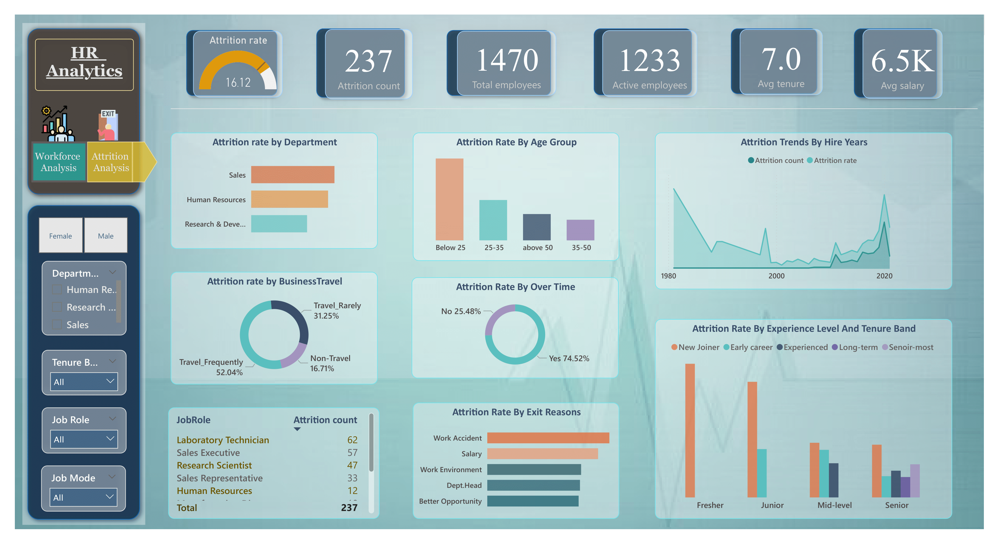
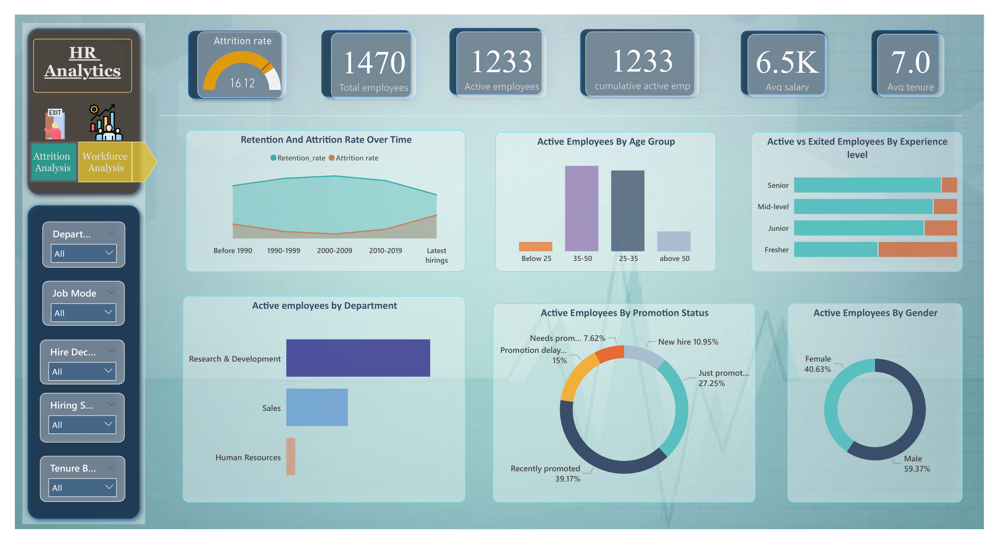

# 📊 HR Analytics Case Study – SQL & Power BI

An end-to-end HR Analytics case study using sample dataset reflecting real-world employee attrition and workforce patterns through SQL-based data cleaning, EDA and Power BI dashboards with actionable business insights.

🔗 [View the dataset on Kaggle](https://www.kaggle.com/datasets/singhnproud77/hr-attrition-dataset)
> 🔎 Based on the IBM HR Analytics dataset, restructured to simulate a realistic multi-table HR database.
---

## 🚀 Project Objectives

- Identify the key factors driving employee attrition
- Analyze workforce trends by department, age, gender, education, and job roles
- Present clear and actionable insights through dashboard visuals
- Provide business-focused recommendations to reduce attrition and improve retention

---

## 🛠️ Tools & Skills Applied

- **SQL (MySQL Workbench)** – Data cleaning, transformation, joins, and exploratory analysis
- **Power BI** – Dashboard design using DAX and visual storytelling
- **Problem-Solving Mindset** – Framing business questions and solving them with data
- **Canva** – Visual layout and report formatting

---

## 📁 Project Files

- **`README.md`**  
  → You're here! Summary of the project with dashboard previews and insights

- **`HR Analytics Project.pdf`**  
  → Full project report including documentation, SQL queries, dashboards, and business recommendations

- **`HR_Analytics_Queries.sql`**  
  → Structured SQL file with problem statements and queries used across the project

- **Dashboard Screenshots**
  - `hr-attrition-dashboard.png` → Power BI Dashboard Page 1: Attrition Insights
  - `workforce-overview-dashboard.png` → Power BI Dashboard Page 2: Workforce Overview

---

## 📊 Dashboard Previews

### 🔍 Page 1 – Attrition Insights

### 🧭 Page 2 – Workforce Overview

### 📌 Interactive Features

> 🛠️ Both dashboards include **drill-down capabilities**, **slicers for dynamic filtering**, and **page navigation buttons** for smooth transitions between views.

> Dashboards built using Power BI with custom DAX measures to track attrition rate, salary trends, employee demographics, and more.

---

## 📈 Core Insights & Patterns

- 📉 Highest attrition in Sales (20.6%) and HR (19%) – exceeding benchmark  
- 🧑‍🏭 Work accidents, low salaries, and overtime are top exit reasons  
- 👩‍💼 Female attrition in HR = **30%**, highlighting gender balance issues  
- 🧑‍🎓 Juniors & young hires most at risk — onboarding & mentoring needed  
- 🏢 Retention strongest in earlier hire decades; declined in recent years

---

## 💡 Business Recommendations

- Improve onboarding and mentoring for new or young employees
- Monitor and optimize overtime and travel burden
- Promote gender balance in HR roles
- Conduct regular engagement and exit surveys
- Analyze historical trends to predict and prevent attrition

---

> ## 📫 Contact

* [LinkedIn – Kashish Pal](https://linkedin.com/in/kashishpal04)
* [Email: kashishpal2020@gmail.com](mailto:kashishpal2020@gmail.com)

* > 🛠️ Created bt Kashish Pal|July 2025|Please credit if reused.

